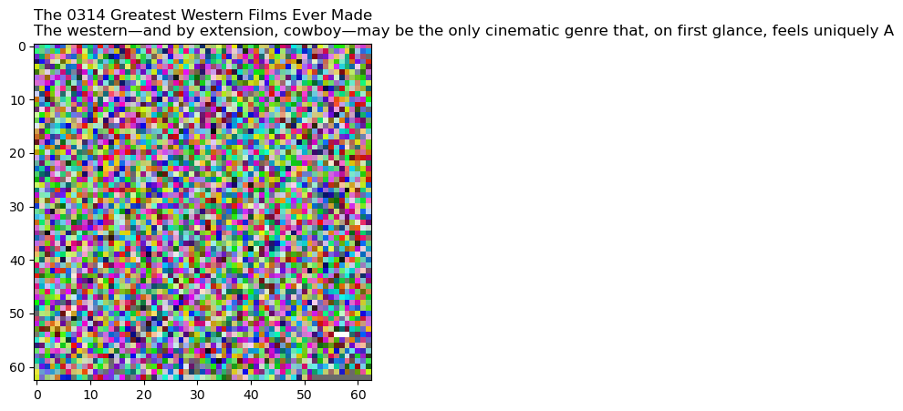

```python
import os
os.chdir('C:\Enigma')

import math 
import numpy as np
from matplotlib import pyplot as plt
import Enegma2 as Enegma

#change this to source file name need to be encrypted
encrypt_file = 'sourcetext.txt'

```


```python
Encode_messages , img = Enegma.Encrypt_To_Image(source_file = encrypt_file , language = Lang_EN)

```


    

    


    ================original TEXT==================
    The 0314 Greatest Western Films Ever Made
    The western—and by extension, cowboy—may be the only cinematic genre that, on first glance, feels uniquely American. The lone no-named figure venturing forth 
    ================ENCODE==================
    `1071041081000011110031110041&10210000611208555999208222999$10000811208`555208&203100006111001^&109>+`+`1001100003112071000061110310000811
    20310610000811444108201777207201107208—8882081001:201555333&1
    ==================================
    


```python
print(Enegma.Decode_Image(img))
```

    the 0314 greatest western films ever madethe westernand by extension, cowboymay be the only cinematic genre that, on first glance, feels uniquely american. the lone no-named figure venturing forth into the wild10 4into the frontier, into the lawless unknown regions of a country still unearthing its identity. of course, there are a few caveats. like how many of the genres ancestors were wielding samurai swords, not colt revolvers. and how the ground on which clint eastwood and others shot was by the mediterranean, not beneath the american blood meridian. plus, the genres most famous director grew up in rome. so yeah... so much for americana.still, the western / cowboy film remains a genre close to the americans heart and always in our adventure-loving imagination. thus our current selection.and yeah, yeah, yeah, we could go down the list of clint 37654 eastwoods (or john wayne 's) filmography, and after pale rider, and hang em high, and higher plains drifter, hell, just about half this list will have eastwoods mug on it. instead, were gonna mix things up a bit and try and sample some variety. dont worry, theres plenty of john ford and sergio leone and the spaghetti westernso dont go gettin your chaps all in a bunch. but were expanding to include some modern attempts (however uneven) as well as genre-twists and foreign influences on this americana of american genres.234567890okay, enough of this slow standoff. here are the 340 best western and cowboy movies of all time. 
    


```python
!type  sourcetext.txt

```

    The 0314 Greatest Western Films Ever Made
    The western—and by extension, cowboy—may be the only cinematic genre that, on first glance, feels uniquely American. The lone no-named figure venturing forth into the wild, into the frontier, into the lawless unknown regions of a country still unearthing its identity. Of course, there are a few caveats. Like how many of the genre’s ancestors were wielding samurai swords, not colt revolvers. And how the ground on which Clint Eastwood and others shot was by the Mediterranean, not beneath the American blood meridian. Plus, the genre’s most famous director grew up in Rome. So yeah... so much for Americana.
    
    Still, the western / cowboy film remains a genre close to the American’s heart and always in our adventure-loving imagination. Thus our current selection.
    
    And yeah, yeah, yeah, we could go down the list of Clint 37654 Eastwood’s (or John Wayne 's) filmography, and after Pale Rider, and Hang ’Em High, and Higher Plains Drifter, hell, just about half this list will have Eastwood’s mug on it. Instead, we’re gonna mix things up a bit and try and sample some variety. Don’t worry, there’s plenty of John Ford and Sergio Leone and the spaghetti western—so don’t go gettin’ your chaps all in a bunch. But we’re expanding to include some modern attempts (however uneven) as well as genre-twists and foreign influences on this Americana of American genres.
    
    1234567890
    
    Okay, enough of this slow standoff. Here are the 340 best western and cowboy movies of all time.
    


```python

```
